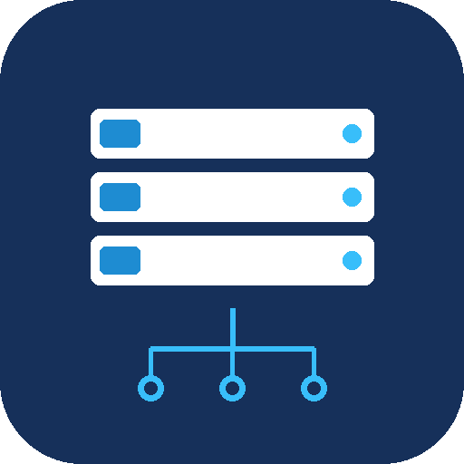
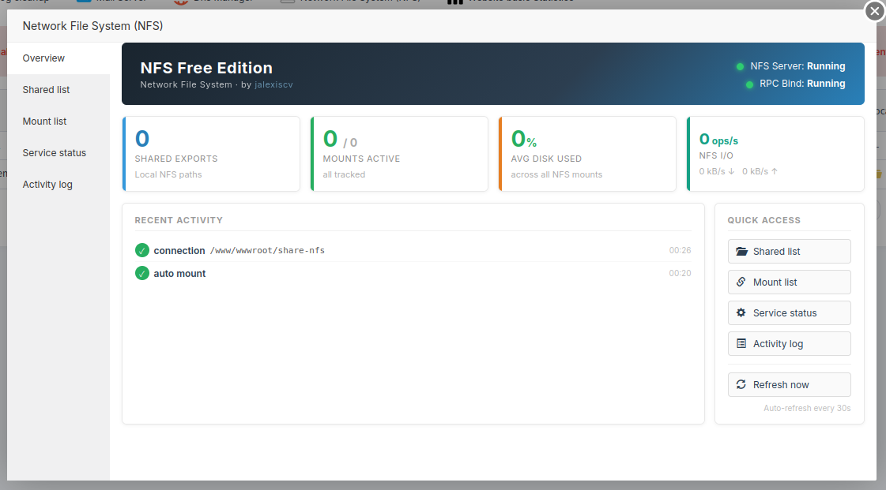

<div align="center">



# Network File System (NFS) — Free Edition

**Free, open-source aaPanel plugin for complete NFS management**

Share directories, mount remote filesystems, monitor your NFS server<br/>
and diagnose mount failures — all from a graphical panel interface.

<br/>

[](LICENSE)
[](https://github.com/jalexiscv/aaPanel-nfs-free/releases)
[](https://www.python.org/)
[](https://github.com/jalexiscv/aaPanel-nfs-free)
[](https://www.aapanel.com/)
[](README_EN.md#1-about-the-nfs-protocol)

<br/>

[](https://github.com/jalexiscv/aaPanel-nfs-free/stargazers)
[](https://github.com/jalexiscv/aaPanel-nfs-free/network/members)
[](https://github.com/jalexiscv/aaPanel-nfs-free/issues)

</div>

---

## Features

| | |
|---|---|
| 📂 **NFS Shares** | Create and manage exports with per-client IP/CIDR control, rw/ro modes and squash policies |
| 🔗 **Remote Mounts** | Mount remote NFS paths with full protocol options: NFSv3/v4, rsize/wsize, TCP/UDP, hard/soft |
| 📊 **Server Monitoring** | Live status of `nfs-server` and `rpcbind`, RPC service list, `/proc/net/rpc` stats, `nfsiostat` I/O metrics |
| 🚀 **Auto-mount at Boot** | SysV init service mounts all `auto_mount=1` entries automatically on system startup |
| 🔍 **Intelligent Diagnostics** | 7-step failure analysis — ping, IP detection, port check, showmount, CIDR matching — with actionable suggestions |
| 📋 **Activity Log** | Thread-safe audit log of every operation, filterable by event type, result and IP address |
| 🔄 **Connection Tracking** | Detects mounts and client connections that happen outside the plugin in real time |

---

## Quick Install

```bash
# 1. Copy plugin files to the aaPanel plugin directory
cp -r nfs_free/ /www/server/panel/plugin/nfs_free/

# 2. Run the installer
sudo bash /www/server/panel/plugin/nfs_free/install.sh install
```

The installer handles NFS packages, fixed-port configuration for mountd (20048),
firewall rules, SysV init service and systemd service activation automatically.

---

## Screenshots

### Dashboard



### Shared List

```
┌──────────────────────────────────────────────────────────────────────────────┐
│  [+ Add Share]                                    Ports: 111/2049/20048      │
├────────────┬──────────────┬──────┬───────┬────────────┬───────────┬─────────┤
│ Name       │ Path         │ Mode │ Sync  │ Squash     │ Allowed   │ Actions │
├────────────┼──────────────┼──────┼───────┼────────────┼───────────┼─────────┤
│ web-assets │ /www/assets  │ rw   │ async │ all_squash │ 10.0.0./24│ ✎  🗑  │
│ backups    │ /data/backup │ ro   │ sync  │ root_squash│ 10.0.0.5  │ ✎  🗑  │
│ shared     │ /data/shared │ rw   │ async │ all_squash │ *         │ ✎  🗑  │
└────────────┴──────────────┴──────┴───────┴────────────┴───────────┴─────────┘
```

### Mount List

```
┌────────────────────────────────────────────────────────────────────────────────────┐
│  [+ Add Mount]                                                                     │
├────────────┬────────────────┬─────────────┬────────────────┬────────┬─────────────┤
│ Name       │ Server         │ Remote Path │ Local Path     │ Status │ I/O ops/s   │
├────────────┼────────────────┼─────────────┼────────────────┼────────┼─────────────┤
│ production │ 192.168.1.100  │ /data/app   │ /mnt/nfs-prod  │ ● UP   │ 12.4  ▲ ▼  │
│ backups    │ 192.168.1.200  │ /backup     │ /mnt/backups   │ ● UP   │  3.1  ▲ ▼  │
│ staging    │ 192.168.1.101  │ /data/stage │ /mnt/staging   │ ○ DOWN │   —   ▲ ▼  │
│ legacy     │ 10.0.0.50      │ /exports    │ /mnt/legacy    │ ○ DOWN │   —   ▲ ▼  │
└────────────┴────────────────┴─────────────┴────────────────┴────────┴─────────────┘
```

### Service Status

```
┌──────────────────────────────────┐  ┌──────────────────────────────────┐
│  nfs-server          ● ACTIVE    │  │  rpcbind             ● ACTIVE    │
│                                  │  │                                  │
│  [Start] [Stop] [Restart]        │  │  [Start] [Stop] [Restart]        │
│  [Reload]                        │  │  [Reload]                        │
└──────────────────────────────────┘  └──────────────────────────────────┘
  RPC Services:  [nfs·tcp] [nfs·udp] [mountd·tcp] [nlockmgr] [status]

┌─────────────────────────────────────────────────────────────────┐
│  [NFSv3 Server] [NFSv3 Client] [NFSv4 Server] [NFSv4 Ops]      │
│                                                                  │
│  getattr   setattr   lookup    access    read     write         │
│  184,211    12,043   98,774   201,554   744,820   310,092       │
└─────────────────────────────────────────────────────────────────┘
```

### Activity Log

```
┌──────────────────────────────────────────────────────────────────────┐
│  Filter: [All events ▾]  [All results ▾]  [IP filter...] [Clear log]│
├────────┬─────────────┬────────┬────────────────┬──────────┬──────────┤
│  ID    │ Event       │ Result │ Details        │ Duration │ Time     │
├────────┼─────────────┼────────┼────────────────┼──────────┼──────────┤
│ a1b2c3 │ 🟢 mount    │  ✔ ok  │ /mnt/prod      │  142 ms  │ 10:42:07 │
│ d4e5f6 │ 🟢 share    │  ✔ ok  │ web-assets     │    — ms  │ 10:35:21 │
│ 789abc │ 🔵 connect  │  ✔ ok  │ 10.0.0.5 in    │    —     │ 10:10:04 │
│ def012 │ 🔴 mount    │  ✘ err │ /mnt/old       │ 5012 ms  │ 08:50:33 │
└────────┴─────────────┴────────┴────────────────┴──────────┴──────────┘
```

---

## Ports Required on the Server

| Port  | Service | Protocol | Role |
|-------|---------|----------|------|
| 111   | rpcbind | TCP/UDP  | Port mapper |
| 2049  | nfs     | TCP      | NFS data transfer |
| 20048 | mountd  | TCP/UDP  | Mount requests (pinned) |
| 32874 | lockd   | TCP/UDP  | File locking |
| 32876 | statd   | TCP/UDP  | State recovery |

---

## Documentation

<div align="center">

| Language | File |
|----------|------|
| 🇪🇸 Español | [README_ES.md](README_ES.md) |
| 🇧🇷 Português | [README_PT.md](README_PT.md) |
| 🇬🇧 English | [README_EN.md](README_EN.md) |
| 🇯🇵 日本語 | [README_JA.md](README_JA.md) |
| 🇩🇪 Deutsch | [README_DE.md](README_DE.md) |
| 🇷🇺 Русский | [README_RU.md](README_RU.md) |

</div>

---

## Contributing

1. Fork the repository
2. Create a feature branch: `git checkout -b feature/my-feature`
3. Commit your changes: `git commit -m 'Add: my feature'`
4. Push and open a Pull Request

See [README_EN.md](README_EN.md#12-contributing) for full contribution guidelines.

---

<div align="center">

Made with care by **[Jose Alexis Correa Valencia](https://github.com/jalexiscv)** · Colombia 🇨🇴

[](https://github.com/jalexiscv)
[](https://www.linkedin.com/in/jalexiscv/)
[](mailto:jalexiscv@gmail.com)

*Network File System (NFS) Free Edition — Copyright © 2023 Jose Alexis Correa Valencia — Published July 31, 2023 — MIT License*

</div>
